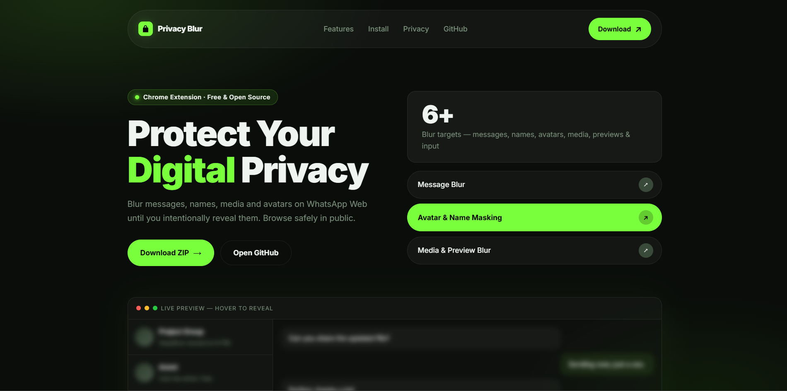
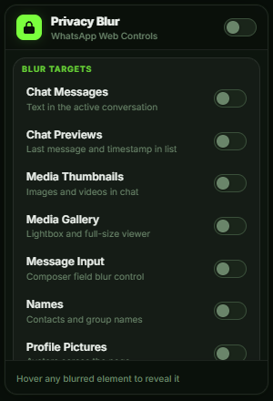

# WhatsApp Privacy Blur

A Chrome extension that blurs WhatsApp Web for shoulder-surfing privacy. Browse in public, in meetings, or anywhere someone might see your screen — your messages stay hidden until you choose to read them.

- **Fine-grained blur controls** — toggle 6 individual categories independently
- **Adjustable blur strength** — slider from 0 to 20px
- **Fast reveal modes** — per-item hover or full-app reveal
- **Fully local** — no analytics, no network requests, no data export

[](https://syeddtaha.github.io/whatsapp-web-privacy-blur/)

---

## Popup



The popup provides a compact settings panel with a master enable/disable toggle, per-category blur toggles, a blur strength slider, and reveal behaviour options. Settings are saved to `chrome.storage.sync` and applied immediately to any open WhatsApp tab.

---

## What it blurs

### Chat Messages
Every message bubble in the open conversation is blurred — incoming and outgoing. This targets the whole bubble row rather than the inner text node, which matters because WhatsApp's layout clips anything blurred at the span level. Hover the bubble to read it.

### Chat List Previews
In the sidebar, preview blur targets message preview content and timestamps while keeping the contact title separate when name blur is off.

### Media Thumbnails
Targets image/video thumbnail surfaces in chat, without blurring message text content such as inline text or reactions.

### Media Gallery
The full-screen media viewer and lightbox. When you click a photo to expand it, it opens blurred. Hover to see it.

### Message Input
What you type in the compose box is blurred. Blur strength follows your slider setting (with a lighter input-specific value).

### Contact and Group Names
Contact names in sidebar rows, the open chat header title, group author names inside messages, and contact/group info drawers.

### Profile Pictures
Avatars in list rows, chat headers, and group/community identity areas. Runtime avatar tagging avoids over-blurring media/reaction images, and keeps original avatar border radius/corner shape intact.

---

## Blur Amount Slider

Control blur intensity from the popup (`0` to `20`).

- `0` = effectively no blur
- Higher values = stronger blur
- Input blur uses a lighter derived value so the composer remains usable

---

## Reveal Behaviour

### Per-item hover (default)
Move your mouse over any blurred element to reveal it. Move away and it blurs again. Everything else on the page stays blurred.

### Instant Reveal
By default the blur fades in and out over 180ms. Turn on **Instant Reveal** to remove the transition entirely — the unblur is immediate on hover.

### Hover App to Reveal All
When on, moving your mouse anywhere over the WhatsApp Web tab unblurs everything at once. Useful when you want to read normally for a stretch without hovering item by item. Move the mouse off the browser window and everything blurs again.

---

## Installation

1. [Download the ZIP](https://github.com/SyeddTaha/whatsapp-web-privacy-blur/archive/refs/heads/main.zip) and unzip it
2. Go to `chrome://extensions/`
3. Enable **Developer mode** (toggle in the top right)
4. Click **Load unpacked** and select the unzipped folder
5. Open [web.whatsapp.com](https://web.whatsapp.com)

Works on Chrome, Edge, Brave, and any Chromium-based browser that supports Manifest V3.

> **Updating from a previous version:** remove the old extension first, then load the new folder. Chrome caches content scripts aggressively and a reload alone sometimes isn't enough.

---

## How it works

The extension injects one `<style>` tag into WhatsApp Web and rebuilds it whenever settings change. No per-element inline style mutation.

**Message blur:** Early versions tried to blur inner `<span>` text nodes. That doesn't work — WhatsApp's parent divs use `overflow: hidden`, which clips the blur glow at the container edge. The fix is blurring the entire `.message-in` / `.message-out` row elements. Those class names aren't obfuscated and have remained stable.

**Avatar blur:** A debounced `MutationObserver` scans candidate images, excludes message/reaction/quoted containers, and tags avatar-like images with `.wpb-av` for CSS targeting.

**Style self-healing:** A second `MutationObserver` watches `<head>`. If WhatsApp's own rendering removes the injected style tag, it gets re-injected immediately.

**Selectors used:** Stable `data-testid` selectors where available, `.message-in` / `.message-out` for message rows, and selective structural fallbacks.

---

## Files

```
whatsapp-privacy-blur/
├── manifest.json       Manifest V3 — scoped to web.whatsapp.com
├── content.js          CSS builder + MutationObserver + avatar scanner
├── blur.css            Minimal base content CSS
├── popup.html          Popup UI markup
├── popup.css           Popup styles (dark / neon-green theme)
├── popup.js            Settings persistence via chrome.storage.sync
├── index.html          Project landing page
├── style.css           Landing page styles
├── docs/
│   ├── screenshot-website.png
│   └── screenshot-popup.png
└── icons/
    ├── icon16.png
    ├── icon48.png
    └── icon128.png
```

---

## Privacy

No data collection. No network requests from the extension. No analytics. All settings live in `chrome.storage.sync`, which is local to your browser (and optionally synced by Chrome across your own signed-in devices). The extension never reads message content — it only applies CSS filters to DOM elements.

---

Built by Taha Jaffri · MIT License
